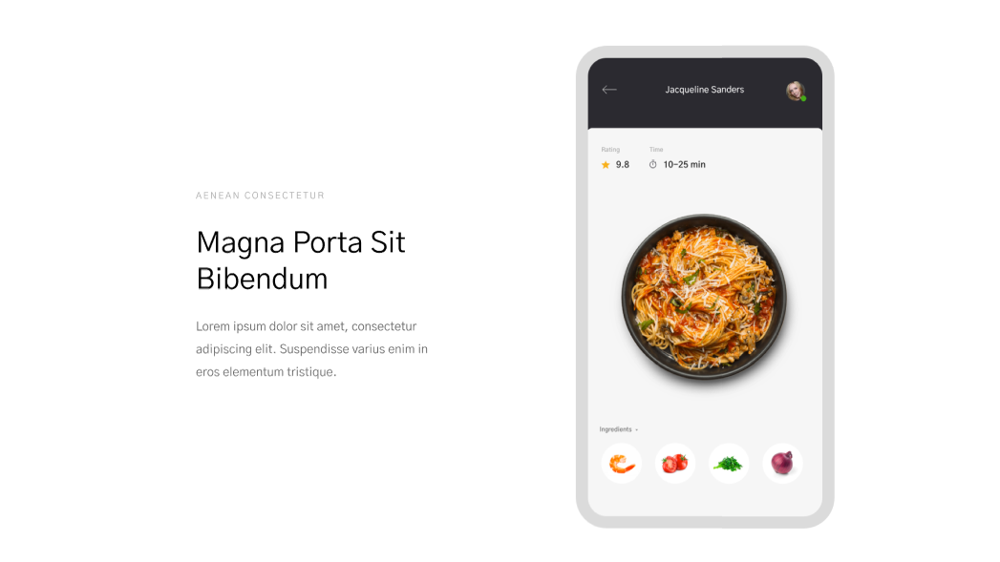

# Лабораторная работа №1, BEM
## Задание №1
голова
голова__ухо
голова__ухо_проколотое

голова
голова__волос
голова__волос_седой

голова
голова__зуб
голова__зуб_золотой

туловище
туловище__рука
туловище__рука_левая

туловище
туловище__живот
туловище__живот_большой

туловище
туловище__грудь
туловище__грудь_накаченная

нога
нога__палец
нога__палец_кривой

нога
нога__колено
нога__колено_больное

нога
нога__ступня
нога__ступня_мягкая

## Задание №2
### Header

`header.header>.container>a.header__logo>img.header__logo-img^nav.header__nav>ul.header__list>li.header__item*4>a.header__link`

### Form

`form.feedback-form>input:email.feedback-form__email+button.button.feedback-form__button`

### Card

`article.card>.card__info>.card__note+h3.card__name+p.card__description^img.card__img`

### Button 

`button.button.button_invisible`